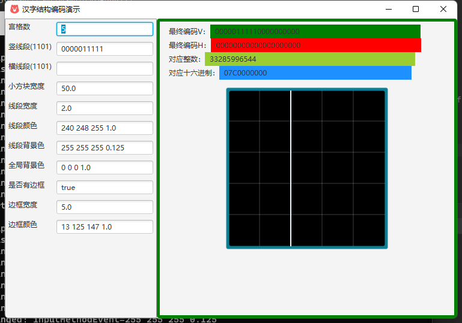
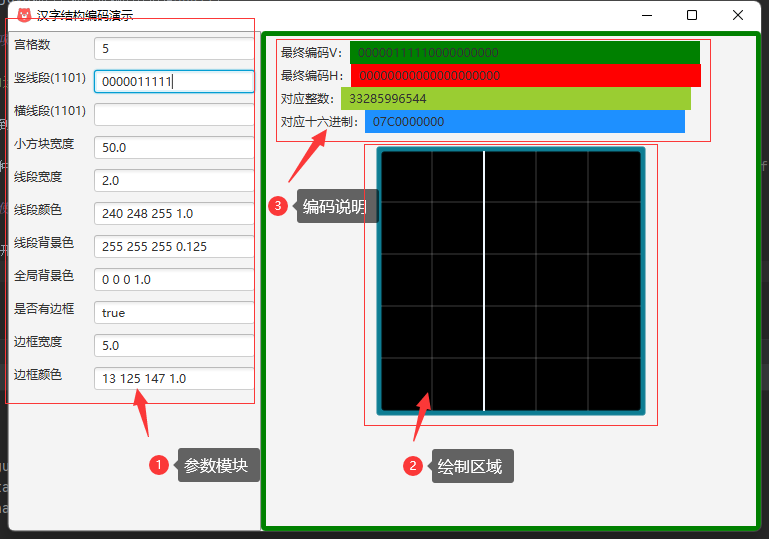
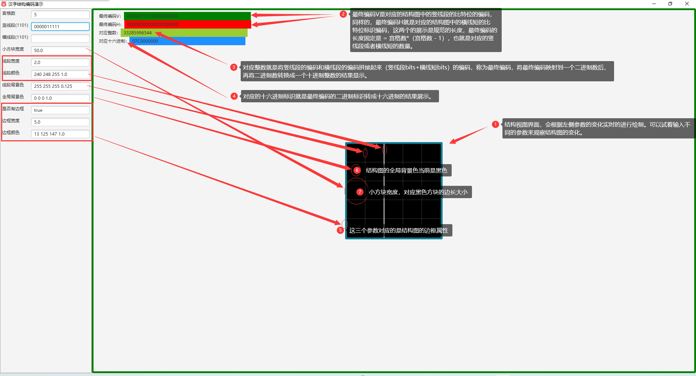

# 汉字结构演示项目说明

这是一个java项目，项目依赖的环境是JDK11；

## 运行项目

> 项目的运行前提是必须要安装JDK版本为11或以上，下面的说明和运行效果在windows系统上面是有效的，针对于mac,linux系统，可以重新将在idea上面运行源码，然后再启动运行项目。

1. 进入到[jar可执行文件目录中](./out)，直接双击`charconfiguration.jar`文件，便可以启动程序。

2. 第二种方式是直接在命令行窗口中直接进入到项目中的`out`目录下, 然后执行命令`D:\Java\jdk11\bin\java -jar .\charconfiguration.jar`，命令中的`D:\Java\jdk11` 要替换成自己安装的jdk目录。

## 程序使用说明

程序刚打开的界面如下图所示：

主程序界面分成三个板块如下所示

在参数模块中输入对应的参数，结构图绘图界面会相应的更新绘制。其中主要的参数是竖线段和横线短参数，这两个参数对应的就是结构图内部对应的横线短和竖线段是否显示的标识。

应用程序窗口可以任意调节窗口大小，并且可以最大化，主界面的各个位置大概说明如下：

各个参数的说明表

参数名称 | 参数类型 | 参数说明
--- | --- | ---
宫格数 | integer | 对应结构图纵向或者横线所包含的小方块数量，取值范围 2-无穷大，但是最大数量收到绘制区域大小的限制。
竖线段(1101) | string | 字符串值从左到右依次对应结构图中的内部竖线段从上到下，从左到右的顺序，1标识要重绘线段，0为默认线段仍使用原来背景色。输入字符串中，只能包含0，1两种字符，输入其他值，结构图不会重新绘制。
横线段(1101) | string | 字符串值从左到右依次对应结构图中的内部横线段从左到右，从上到下的顺序，1标识要重绘线段，0为默认线段仍使用原来背景色。输入字符串中，只能包含0，1两种字符，输入其他值，结构图不会重新绘制。
小方块宽度 | double | 结构图中每个方块的边长大小，取值范围 20-100，可以通过修改源代码进行控制取值范围
线段宽度 | double | 结构图中网格线的宽度，取值范围 1-10
线段颜色 | color | 结构图中网格线重新绘制的颜色，输入的格式必须按照原来的格式, 格式为rgbc(红绿蓝及透明度，红绿蓝取值 0-255， 透明度取值 0-1.0， 0标识完全透明，1标识完全不透明): (red green blue opacity), 例如 “255 0 0 1.0” 表示为红色。 
线段背景色 | color | 结构图中默认网格线的颜色，输入格式同线段颜色。
全局背景色 | color | 结构图的背景色，默认黑色，输入格式同上。
是否有边框 | bool | 只能是输入字符串true或者false, true标识要绘制边框，false标识不绘制结构图边框。
边框宽度 | double | 结构图的边框的厚度，取值范围 1-10
边框颜色 | color | 结构图的边框的颜色，输入格式同线段颜色

## 参考资料

1. [如何新建JavaFX项目并打成可运行 Jar包](https://www.cnblogs.com/alpha-cat/p/16261453.html)
2. [javaFX官网](https://openjfx.io/)
